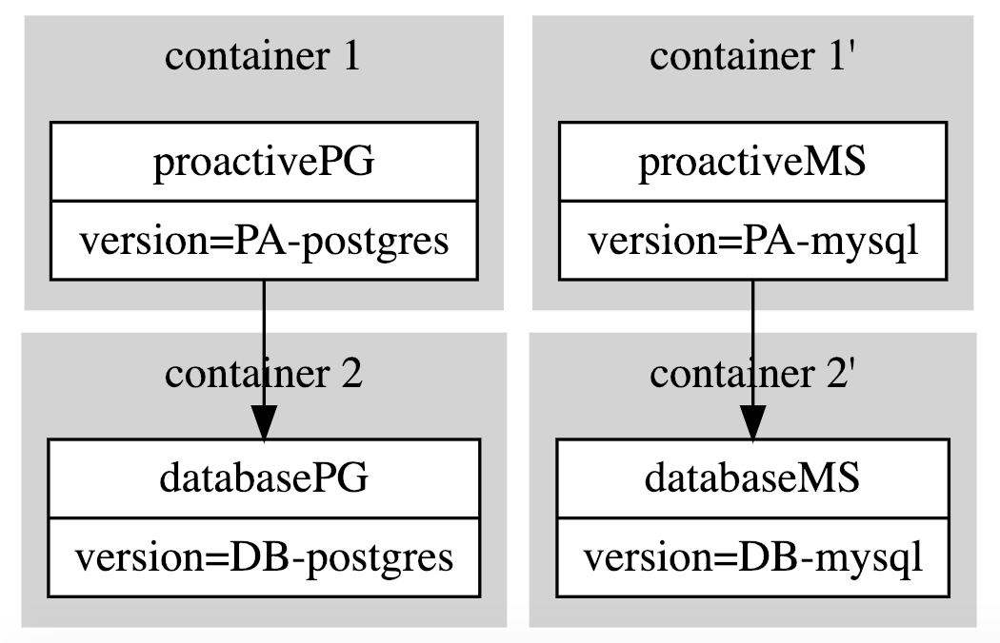

# CAMP Result with Proactive configuration for database support

## Generate and execute configurations:
- To checkout out how Camp is used and adapted for Proactive configuration, please follow the configuration steps as described in the [Readme file](CAMP_Configuration/README.md).
The generated configurations are as below:


## Failing system tests 
- Our system tests related to GraphQL Rest API are executed across the two generated configurations with the following gradle configuration:
```
task testStamp (type: Test){
  if (project.hasProperty('local')) {
      systemProperties "spring.profiles.active": "local"
  }
    include 'org/ow2/proactive/systemtests/test/rest/graphql/**' 
}
```
- Tests are executed using the following command 
```bash
./gradlew clean -Plocal testStamp --stacktrace
```
- The subset of failing system tests is provided in [SchedulingApiGraphQlTest.java](CAMP_Tests/SchedulingApiGraphQlTest.java). This test class contains 7 tests.
## Results
- The results of failing system tests are provided in [CAMP Results](CAMP_Results/). 
#### Config 1: Proactive + MySQL database 
- 7 excecuted tests for config 1: Proactive + MySQL database pass with no reported errors.
- See the test report available in [index.html](CAMP_Results/Test_Report/Config_1_Proactive-MS/index.html).
#### Config 2: Proactive + PostgresQL database 
- 5 among the 7 excecuted tests for Config 2: Proactive + PostgresQL database fail.
- See the test report available in [index.html](CAMP_Results/Test_Report/Config_2_Proactive-PG/index.html).
- See the complete docker container logs of the two running services after running these tests [docker-log-errors.log](CAMP_Results/Test_Report/docker-log-errors.log).
- The reported error messages are the following:
```
database_1   | ERROR:  operator does not exist: text ~~ bigint at character 1413
database_1   | HINT:  No operator matches the given name and argument type(s). You might need to add explicit type casts.
```
## Conclusion
- The failing tests in Config 2 are due to a wrong configuration of the Proactive server with the PostgresQL database. It is related to a wrong given field type to the PostgresQL DB. This miss-configuration was not possible to detect without the use of CAMP. 


